# 📝 BlogSphere


BlogSphere is a full-stack MERN blogging platform inspired by Medium, built to deliver a modern blogging experience. It enables users to create, save drafts, publish, and discover blogs while engaging through likes, bookmarks, follows, and nested comments. The platform features secure JWT and Google authentication, rich text editing with EditorJS, Cloudinary-powered image uploads, and a fully responsive user interface.

---

## 🌐 Live Demo

**Frontend:** https://blogsphere-ecru.vercel.app/

**Backend API:** https://blogsphere-x9sv.onrender.com/

---

## 🚀 Why BlogSphere?

BlogSphere was developed as a real-world full-stack application to demonstrate modern web development practices. It focuses on secure authentication, scalable RESTful APIs, efficient state management, responsive UI design, and social interaction features commonly found in modern blogging platforms.

---

## ✨ Features

### 🔐 Authentication

- JWT-based Authentication
- Google Sign-In using Firebase Authentication
- Protected Routes
- Secure User Sessions

### ✍️ Blogging

- Create, Edit, Delete & Save Draft Blogs
- Rich Text Editing with EditorJS
- Image Uploads using Cloudinary

### 💬 Social Features

- Like Blogs
- Save (Bookmark) Blogs
- Follow / Unfollow Users
- Nested Comments & Replies

### 👤 User Features

- User Profiles
- View Published & Draft Blogs
- Search Blogs
- Tag-based Filtering
- Pagination

### 📱 User Experience

- Fully Responsive Design
- Clean and Modern UI
- Optimized API Integration
- Smooth User Experience

---

## 🛠️ Tech Stack

### Frontend

- React.js
- Vite
- Redux Toolkit
- React Router DOM
- Tailwind CSS
- Axios
- EditorJS

### Backend

- Node.js
- Express.js
- MongoDB Atlas
- Mongoose
- JWT Authentication
- Firebase Admin SDK
- Cloudinary
- Multer

### Deployment

- **Frontend:** Vercel
- **Backend:** Render

---

## 📸 Screenshots

### 🏠 Home Page

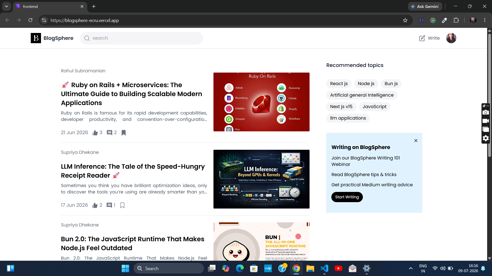

---

### 📰 Blog Details

| Blog Details (Part 1) | Blog Details (Part 2) |
|-----------------------|-----------------------|
| 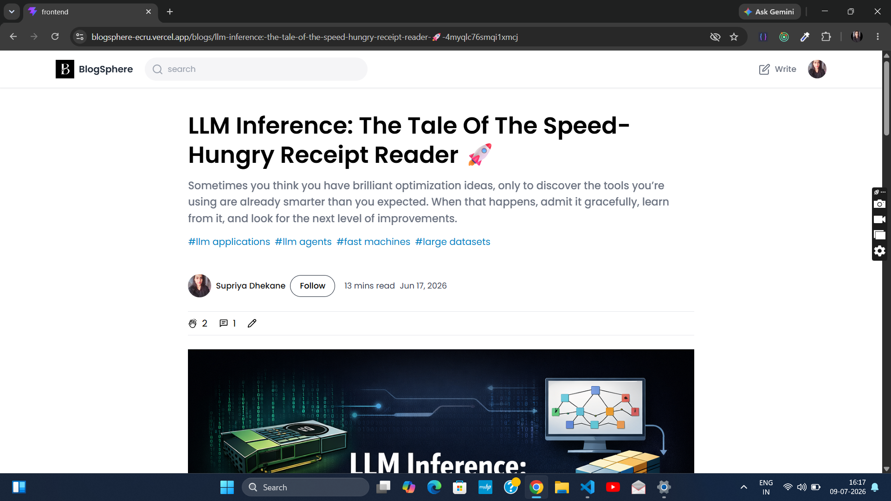 | 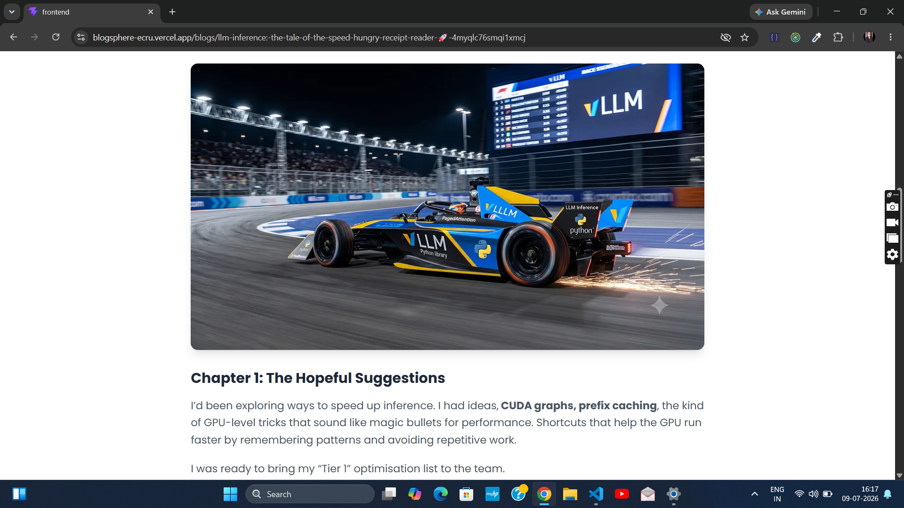 |

---

### ✍️ Create Blog

| Create Blog (Part 1) | Create Blog (Part 2) |
|----------------------|----------------------|
| 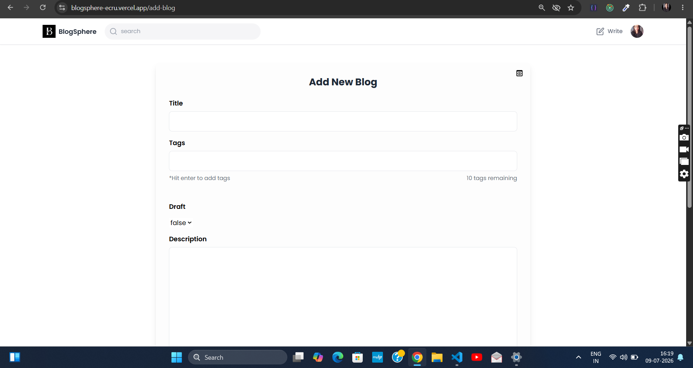 | 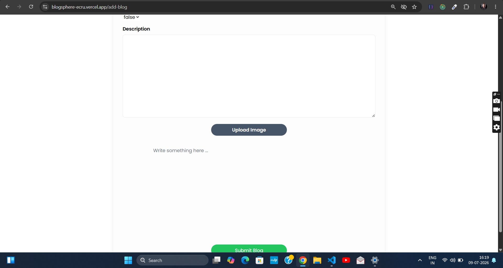 |

---

### 👤 User Profile

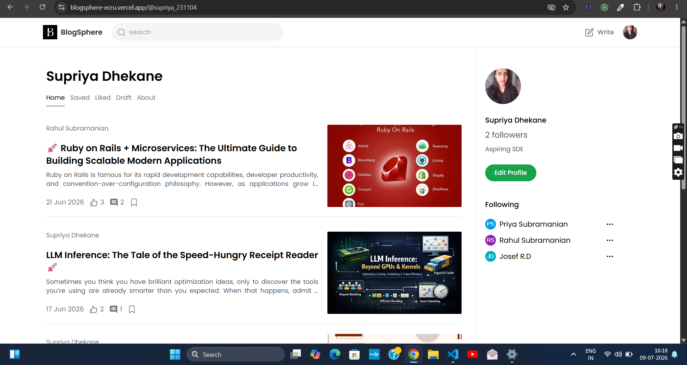

---

### 🔍 Search Results

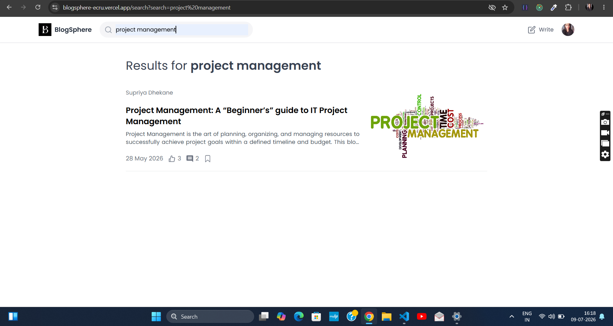

---

### ⚙️ Update Profile

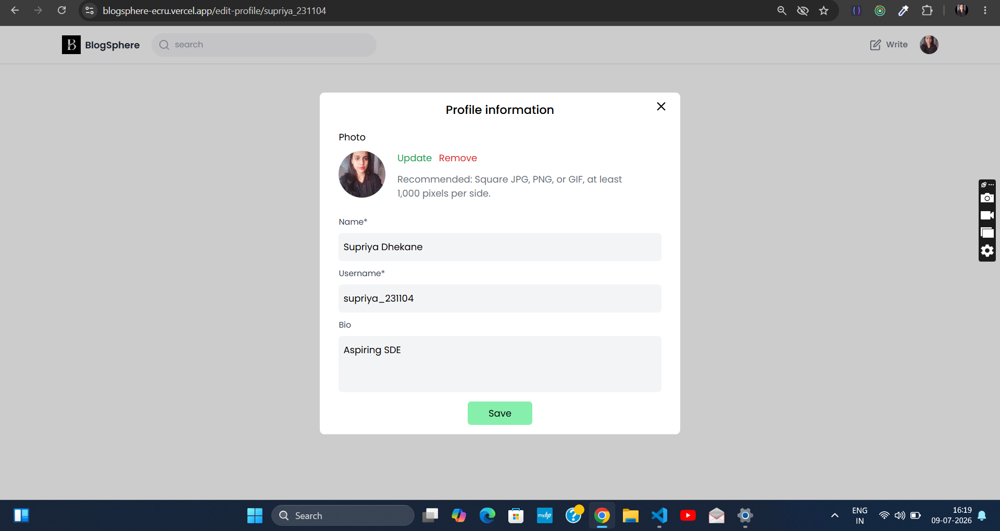

---

### 🔐 Authentication

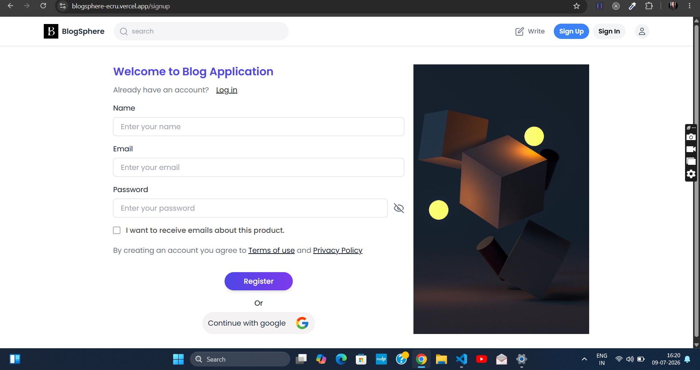

---

### 💬 Comments & Replies

| Comments | Replies |
|-----------|---------|
| 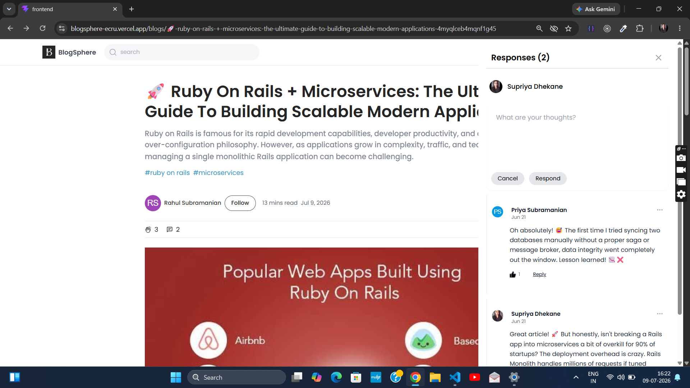 | 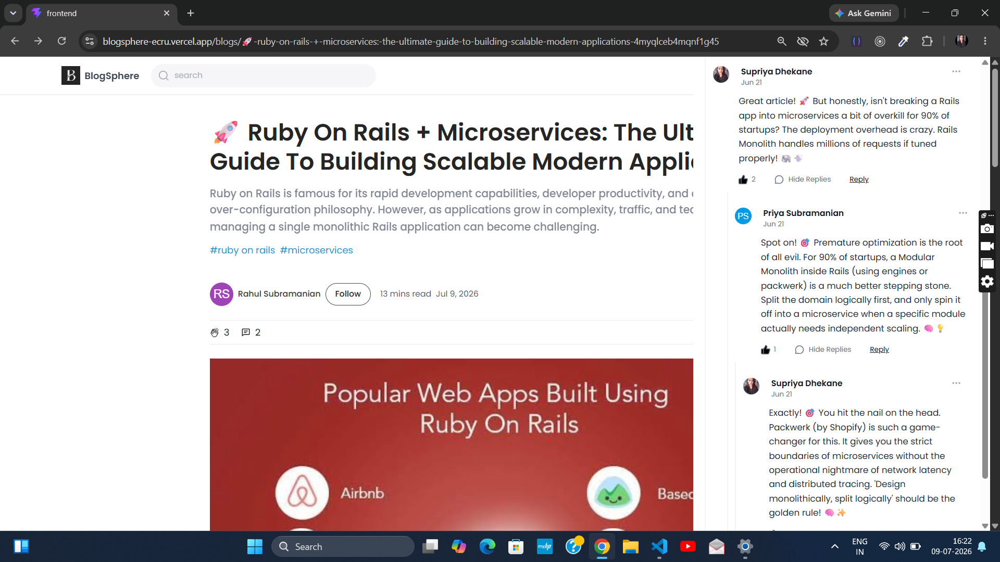 |

---

## 📂 Project Structure

```text
BlogSphere
│
├── frontend
│   ├── src
│   ├── public
│   └── package.json
│
├── backend
│   ├── controllers
│   ├── middleware
│   ├── models
│   ├── routes
│   ├── utils
│   └── package.json
│
└── README.md
```

---

## 🚀 Getting Started

### Clone the Repository

```bash
git clone https://github.com/supriya231104/BlogSphere.git
```

### Install Dependencies

#### Frontend

```bash
cd frontend
npm install
```

#### Backend

```bash
cd backend
npm install
```

---

## ⚙️ Environment Variables

Create a `.env` file inside the **backend** directory.

```env
PORT=

MONGODB_URL=

JWT_SECRET=

CLOUDINARY_CLOUD_NAME=

CLOUDINARY_API_KEY=

CLOUDINARY_API_SECRET=

FIREBASE_PROJECT_ID=

FIREBASE_PRIVATE_KEY=

FIREBASE_CLIENT_EMAIL=
```

Create another `.env` file inside the **frontend** directory.

```env
VITE_API_BASE_URL=

VITE_FIREBASE_API_KEY=

VITE_FIREBASE_AUTH_DOMAIN=

VITE_FIREBASE_PROJECT_ID=

VITE_FIREBASE_STORAGE_BUCKET=

VITE_FIREBASE_MESSAGING_SENDER_ID=

VITE_FIREBASE_APP_ID=
```

---

## 💡 Key Highlights

- Full-stack MERN application with separate frontend and backend deployment
- RESTful API architecture
- JWT-based authentication with protected routes
- Google OAuth integration using Firebase Authentication
- Rich text editing powered by EditorJS
- Cloudinary integration for image management
- Nested commenting system for threaded discussions
- Redux Toolkit for predictable global state management
- MongoDB Atlas cloud database
- Fully responsive user interface

---

## 🔮 Future Improvements

- Real-time Notifications
- Email Notifications
- Dark Mode
- Reading History
- Blog Analytics (Views & Reading Time)
- User-to-User Messaging
- Admin Dashboard
- Progressive Web App (PWA) Support

---

## 👩‍💻 Author

**Supriya Dhekane**

If you found this project helpful, consider giving it a ⭐ on GitHub.